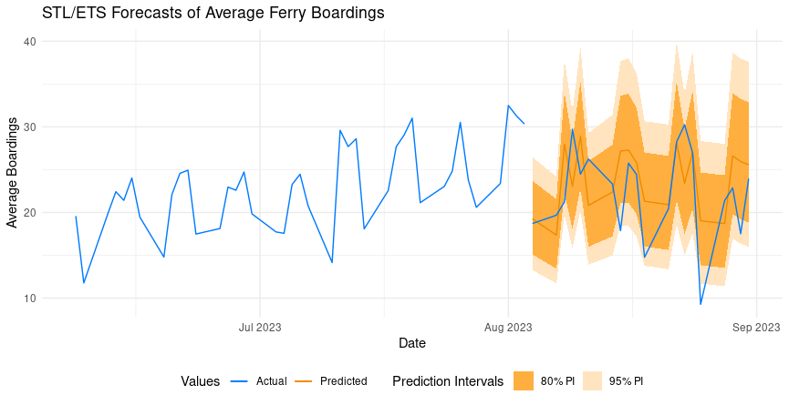

# Time Series Analysis and Forecasting for MBTA Ferry Boardings

This repository contains the code used to perform a thorough time seies analysis of MBTA ferry boardings data acquired from the 
[MBTA open data portal](https://mbta-massdot.opendata.arcgis.com/). The particular [data used](https://mbta-massdot.opendata.arcgis.com/datasets/MassDOT::mbta-ferry-daily-ridership-by-trip-route-and-stop/about) 
contained daily ferry ridership by trip, route, and stop. 

The analysis and forecasting results can be view within [this R Markdown notebook](https://andrewdisher.github.io/mbta-time-series-analysis/). 

## Goals

1. Aggregate the data according to day, since it is stored as boat trips with passenger counts.
2. Identify any outliers or missing data, and perform data imputation if necessary.
3. Perform time series cross validation during model selection.
4. Identify suitablee models for forecasting. Modeling methods considered include ARIMA, ETS, and Dynamic Harmonic Regression.
5. Produce forecasts to compare models’ performance.
6. Produce a combination forecast, averaging the point forecasts of each model and creating a combined prediction interval. This is a form of ensemble forecasting.

## Results

The daily ridership data presented a large challenge to model correctly with time series models, since it possessed a large amount
of seasonality. Due to the fact that it was daily data, there existed a yearly seasonal cycle and a weekly seasonal cycle. In fact, the 
original data was in the form of hourly trips, so it likely even possessed daily seasonality over the course of the service day hours 
when the ferries were operating. 

In the end, a suitable Error-Trend-Seasonal (ETS) model was obtained, accompanied by a Seasonal and Trend Decomposition using Loess (STL). This model 
outperformed both ARIMA and Dynamic Harmonic Regression forecasts and was able to explain the complex seasonality within the data. A sample graph is showm
below, where the model forecasted 4 weeks (20 observations, 5 for each weekday in a week) of test data and produced remarkably good results. 



## Local Project Download

To view each of the files in a local project, first clone this repository or download the files in a .zip file. 

Once you have opened the project in either RStudio or VSCode, run the following command. 

```
renv::restore()
```

This will download the R package dependencies required for the project, which are tracked by the `renv` R package. For a list of package dependencies, you can view the 
***dependencies.R*** file. This file is not meant to be run, since `box` is used to declare all package imports within the R scripts and the R Markdown notebook. 
***dependencies.R*** has the sole purpose of making it easier for renv to find dependencies, since not all packages needed are loaded by `box`.

Note that RStudio is recommended to knit R Markdown documents, since there are issues with the R implementation in VSCode that make it inconsistent. 

## `box` Package and Documentation

Box is an incredible package for many reasons. It's main usage is for declaring package imports within R scripts, similar to `library()` calls, except that 
box doesn't load all functions exported by a package. Using the notation

```
box::use(package_name[function_1, function_2, etc.])
```

only certain functions will be imported, similar to how Python handles imports. This is useful for making imports explicit and easily 
traced. There is an option to import all functions exported by a package by using 

```
box::use(package_name[...])
```

However, this should only be done when the number of functions actually needed froma  package is exceedingly large.

The other main use for the `box` package is for documentation of custom built functions. Within the **functions/plotting/** directory
there is a file called ***time_series.R***. This file contains a number of custom functions that were used to make creating 
mainy kinds of graphs easier and more repeatable. 

Typically, to get help page documentation in R, you would run the code

```
?function_name
```

For custom functions imported by box, you can first run the code to import a box module, namely

```
box::use(functions/plotting[time_series])
```

and then, as an example, ask for the documentation for the function `model_diagnostics` by running

```
box::help(time_series$model_diagnostics)
```

This will give you a help page describing the function's purpose, its input arguments and types, its output, and some examples. 

## Acknowledgements

The content of this notebook is my own creation, but I would like to acknowledge where much of the knowledge regarding statistical methods
and models came from. Thank you to Dr. Rob Hyndman and George Athanasopoulos, for writing the book [Foreacsting Principals and Practice](https://otexts.com/fpp3/index.html),
where they describe thoughtfully many of the modern forecasting tools economists, financial analysts, researchers, and so many more use 
to derive insight from their data. 

I'd also like to thank the [OPMI](https://www.massdottracker.com/wp/about/what-is-opmi-2/) and the
[MBTA](https://www.mbta.com/) for making the data used in this analysis publicly available. 


